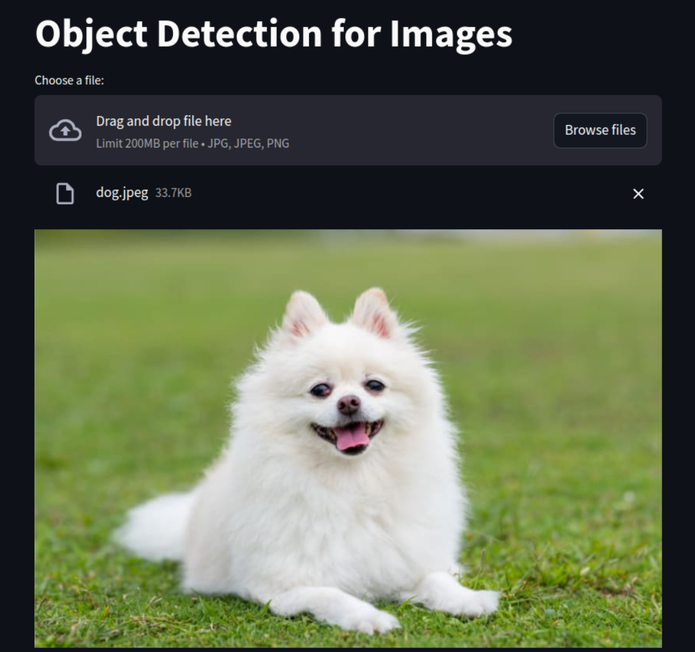

# streamlit-three-mini-project

## Project 1: Word Correction Using Levenshtein Distance

### Demo:

  

### Description:

This project applies word correction, a key aspect of natural language processing (NLP). It aims to develop applications that suggest the correct version of potentially misspelled words. Using the Levenshtein distance, which measures the minimum number of edits needed to transform one word into another, the project enhances text input accuracy by correcting misspellings.

## Project 2: Object Detection for Images using DNN Model from OpenCV

### Demo:

  
   

### Description:

This project focuses on Object Detection, a critical application of image processing aimed at identifying objects within an image. Using the DNN module from the OpenCV library, users can upload an input image, and the model will detect and return bounding boxes with the coordinates of detected objects.